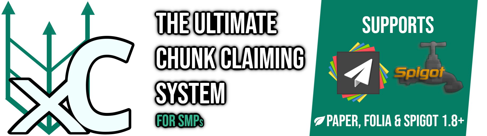

<h1 align="center">

</h1>

<h2>
<a href="https://github.com/WasabiThumb/xclaim/blob/master/README.md" title="Amerikanisches Englisch">🇬🇧</a>
&nbsp;
<a href="https://github.com/WasabiThumb/xclaim/blob/master/README.de.md" title="Deutsch">🇩🇪</a>
&nbsp;
<a href="https://github.com/WasabiThumb/xclaim/blob/master/README.zh.md" title="Vereinfachtes Chinesisch">🇨🇳</a>
</h2>

  <a style="margin:0.3rem;padding:0.5em;background-color:#303030;border-radius:0.5em" href="#installation">Installation</a>
  <a style="margin:0.3rem;padding:0.5em;background-color:#303030;border-radius:0.5em" href="#features">Features</a>
  <a style="margin:0.3rem;padding:0.5em;background-color:#303030;border-radius:0.5em" href="#konfiguration">Konfiguration</a>
  <a style="margin:0.3rem;padding:0.5em;background-color:#303030;border-radius:0.5em" href="#berechtigungen">Berechtigungen</a>
  <a style="margin:0.3rem;padding:0.5em;background-color:#303030;border-radius:0.5em" href="#befehle">Befehle</a>
  <a style="margin:0.3rem;padding:0.5em;background-color:#303030;border-radius:0.5em" href="#unterstützte-versionen">Unterstützte Versionen</a>
  <a style="margin:0.3rem;padding:0.5em;background-color:#303030;border-radius:0.5em" href="#entwicklungsplan">Entwicklungsplan</a>

 

Ein besseres Chunk-Claiming Plugin für Paper Server.\
*Verstanden? Es klingt wie exclaim...*

## Installation
Sie können einen Build vom ["Releases"-Tab](https://github.com/WasabiThumb/xclaim/releases) auf der rechten Seite herunterladen oder [selbst das Plugin bauen](https://maven.apache.org/guides/getting-started/maven-in-five-minutes.html#build-the-project), wenn Sie wollen. Platzieren Sie danach die .jar Datei in Ihren "plugins" Ordner. Nutzen Sie nicht die .jar Datei namens "original", außer Sie wissen, was Sie da tun!

## Features
Der Hauptbefehl ist "/xclaim" (alias "/xc"). Dieser erlaubt es Spielern Gebiete zu beanspruchen und zu verwalten. In diesen Gebieten können Berechtigungen vergeben werden, entweder nach allgemeinen Gruppen (Niemand, vertrauenswürdige Spieler, Veteranen, Jeder) oder individuell. Die Benutzeroberfläche erlaubt es zudem vertrauenswürdigen Spielern einem Gebiet hinzuzufügen oder zu entfernen.

### Map-Integrationen
- Die Dynmap-Integration sollte standardmäßig funktionieren, solange alles [ordnungsgemäß konfiguriert](#Konfiguration) ist. Sollte es dennoch Probleme / Bugs geben, melden Sie diese bitte auf der [Issues-Seite](https://github.com/WasabiThumb/xclaim/issues).
- Eine BlueMap-Integration ist auch seit Version 1.10.0 standardmäßig verfügbar.

### Importieren von ClaimChunk
**WICHTIG: Dieser Prozess sollte ohne jegliche angemeldete Spieler auf dem Server durchgeführt werden.** Der Server sollte ClaimChunk **UND** XClaim zur selben Zeit geladen haben. Es besteht die Möglichkeit, dass das Plugin PlaceholderAPI ebenfalls benötigt wird (unbestätigt). Nach dem Import wird allerdings weder ClaimChunk noch PlaceholderAPI benötigt, damit XClaim normal funktioniert. Sobald alles Bereit ist, führen Sie den Befehl /importclaims aus. Die Ausführung könnte eine Weile dauern und ressourcenintensiv sein (dieses Feature wurde auf Skalierbarkeit überprüft), da versucht wird angrenzende Ansprüche zusammenzufassen.

### Sprachen
Seit der Version 1.6.x werden mehrere Sprachen unterstützt. Wenn das Plugin startet, werden die Standard-Sprachpakete in ``/plugins/XClaim/lang`` geladen. Diese beinhalten:
- en-US (Amerikanisches Englisch)
- de (Deutsch) von eingruenesbeb
- zh (Vereinfachtes Chinesisch) von SnowCutieOwO
- tr (Türkisch) von Krayir5

Das Plugin benutzt die Sprache, welche in der "language" Option in der [Konfiguration](#Konfiguration) spezifiziert ist.
\
\
Wollen Sie Ihr eigenes Sprachpaket erstellen, so kopieren Sie ein vorhandenes (z.B. ``/plugins/XClaim/lang/en-US.json``) und benennen es [entsprechend](https://en.wikipedia.org/wiki/List_of_ISO_639-1_codes) um (z.B. ``fr.json`` für Französisch). Nun können Sie den Inhalt dieser Datei übersetzen. Wissen über [JSON](https://en.wikipedia.org/wiki/JSON#Syntax) und [MiniMessage](https://docs.adventure.kyori.net/minimessage/index.html) sind dringlich empfohlen. Übersetzen Sie nicht die Schlüssel, sondern nur die Werte! Sprachpakete können nach der Kodierung für Menschen schwieriger lesbar werden, deshalb ist es empfohlen sich eines von [der Quelle](https://github.com/WasabiThumb/xclaim/tree/master/src/main/resources/lang) zu holen. In manchen Fällen werden Symbole wie ``$1``, ``$2`` u.s.w. ... benutzt. Dies bedeutet, dass dort eine Variable verwendet werden kann. Zum Beispiel ``Hallo $1!`` kann im Spiel zu ``Hallo [Nutzername]!`` werden.

### Wirtschaft
Wirtschaftsfeatures sind standardmäßig deaktiviert. Um sie zu aktivieren, setzen Sie "use-economy" in der Konfiguration auf "true".\
Wenn "use-economy" aktiv ist, wird XClaim versuchen sich in die folgenden Wirtschafts-Plugins einzuhacken (also hacken und nicht hacken versteht sich 🙃):
- Vault
- EssentialsX

Spieler haben dann je nach Gruppe und Einstellungen für Ansprüche zu zahlen (Siehe [hier](#Berechtigungen)).\
Zum Beispiel, wenn Sie den Standardpreis pro zu beanspruchenden Chunk auf 2.25 setzen wollen, dann können Sie das unter ``limits.default.claim-price`` auf ``2.25`` setzen.\
Für alle Optionen siehe: [Konfiguration](#Konfiguration).

## Konfiguration
|                                           Name |                                                                                           Beschreibung                                                                                            | Standardwert       |
|-----------------------------------------------:|:-------------------------------------------------------------------------------------------------------------------------------------------------------------------------------------------------:|:-------------------|
|                                       language |                              Die zu benutzende Sprache. Muss ein valides Sprachpaket aus ``/plugins/XClaim/lang`` sein, andernfalls wird das en-US Paket verwendet.                               | en-US              |
|                                   veteran-time |                                                      Die Zeit in Sekunden, die es an Spielzeit braucht, bevor ein Spieler als Veteran gilt.                                                       | 604800 (1 Woche)   |
|                       stop-editing-on-shutdown |                                                      Ob Spieler beim Herunterfahren des Servers aus dem Chunk-Editor geworfen werden sollen.                                                      | false              |
|                          stop-editing-on-leave |                                                 Ob Spieler aus dem Chunk-Editor geworfen werden sollen, wenn sie das Spiel freiwillig verlassen.                                                  | true               |
|       exempt-claim-owner-from-permission-rules |  Ob Chunk-Besitzer von den Berechtigungsregeln auf ihrem Gebiet implizit ausgenommen werden sollen. Sie sollten dies nicht verändern, da dies hauptsächlich für debugging Zwecke verwendet wird.  | true               |
|                  enforce-adjacent-claim-chunks |                                                               Ob Chunks in einem beanspruchten Gebiet zusammenhängend seien müssen.                                                               | true               |
|                    allow-diagonal-claim-chunks |           Falls "enforce-adjacent-claim-chunks" auf "true" ist, werden Chunks, welche diagonal voneinander sind, als "nebeneinander" behandelt. Andernfalls macht diese Option nichts.            | true               |
|                   enter-chunk-editor-on-create |                                           Wenn auf "true", werden Spieler, die ein neues Gebiet beanspruchen, automatisch in den Chunk-Editor versetzt.                                           | true               |
|                                    use-economy |                                                                     Ob Wirtschaft-Features genutzt werden sollen oder nicht.                                                                      | false              |
|          limits.𝘨𝘳𝘰𝘶𝘱-𝘯𝘢𝘮𝘦.max-chunks |                                  Bestimmt die maximale Anzahl an beanspruchbaren Chunks für die Gruppe. Siehe [Berechtigungen](#Berechtigungen) für mehr Infos.                                   |                    |
|          limits.𝘨𝘳𝘰𝘶𝘱-𝘯𝘢𝘮𝘦.max-claims |                          Bestimmt die maximale Anzahl an Gebieten für die Gruppe. See Permissions for more info. Siehe [Berechtigungen](#Berechtigungen) für mehr Infos.                          |                    |
|          limits.𝘨𝘳𝘰𝘶𝘱-𝘯𝘢𝘮𝘦.give-after |                                         Die Spielzeit in Sekunden, nach der Spieler dieser Gruppe zugeteilt werden. Werte niedriger als 0 bedeuten "nie".                                         | -1                 |
|         limits.𝘨𝘳𝘰𝘶𝘱-𝘯𝘢𝘮𝘦.claim-price |                                                             Bestimmt den Preis für einen Chunk, falls Wirtschaft-Features aktiv sind.                                                             | 20                 |
|      limits.𝘨𝘳𝘰𝘶𝘱-𝘯𝘢𝘮𝘦.unclaim-reward |                            Bestimmt die Anzahl an Währung, die ein Spieler der Gruppe, beim Chunk freigeben, erstattet bekommt, falls Wirtschaft-Features aktiv sind.                             | 0                  |
|         limits.𝘨𝘳𝘰𝘶𝘱-𝘯𝘢𝘮𝘦.free-chunks | Bestimmt die Anzahl an kostenfreien Chunks, bevor Spieler den Preis, welcher in ``limits.𝘨𝘳𝘰𝘶𝘱-𝘯𝘢𝘮𝘦.claim-price`` spezifiziert ist, zahlen müssen, falls Wirtschaft-Features aktiv sind. | 4                  |
| limits.𝘨𝘳𝘰𝘶𝘱-𝘯𝘢𝘮𝘦.max-claims-in-world |                                          Die maximale Anzahl an gleichzeitig beanspruchten Gebieten pro Welt. Werte unter 1 setzen effektiv kein Limit.                                           | -1                 |
|                     dynmap-integration.enabled |                                                                        Wenn "true", wird die Dynmap-Integration aktiviert.                                                                        | true               |
|       dynmap-integration.use-old-outline-style |         Wenn "true", wird Dynmap die alten Konvex-Hüllen-Umrandungen für Anspruchsgebiete verwenden. Dies ist hauptsächlich zum debuggen, da das neue Umrandungssystem experimentell ist.         | false              |
|                          disable-paper-warning |                                       Deaktiviert die Warnung beim Serverstart, wenn das Plugin auf einem Spigot anstelle eines Paper Servers geladen wird.                                       | false              |
|                           worlds.use-whitelist |                                                                             Ob worlds.whitelist beachtet werden soll                                                                              | false              |
|                           worlds.use-blacklist |                                                                             Ob worlds.blacklist beachtet werden soll                                                                              | false              |
|                          worlds.case-sensitive |                                                      Ob Groß- und Kleinschrift für Welten in der Allow-/Denylist berücksichtigt werden soll                                                       | true               |
|                               worlds.whitelist |                                                   Eine Liste, in der alle Welten aufgelistet werden müssen, damit XClaim in ihnen funktioniert.                                                   | Eine Beispielliste |
|                               worlds.blacklist |                                                Eine Liste, in der alle Welten aufgelistet werden müssen, damit XClaim in ihnen NICHT funktioniert.                                                | Eine Beispielliste |
|                              worlds.grace-time |                       Falls ein beanspruchtes Gebiet sich in einer Welt auf der Blacklist befindet, ist dies die Dauer in Sekunden, für welche das Gebiet bestehen bleibt.                        | 604800 (1 week)    |

## Berechtigungen
Keine Sorge, es gibt nicht viele.
| Name | Beschreibung |
| --: | :-- |
| xclaim.override | Erlaubt es Chunks zu überschreiben. |
| xclaim.admin | Erlaubt es jeglichen Anspruch zu bearbeiten/löschen. |
| xclaim.import | Erlaubt es Ansprüche von ClaimChunk zu importieren. |
| xclaim.update | Erlaubt es automatisch Updates zu installieren. |
| xclaim.restart | Erlaubt es XClaim neu zu starten. |
| xclaim.clear | Erlaubt es alle Gebiete eines Spielers mit "/xclaim clear" freizugeben |
| xclaim.group.𝘨𝘳𝘰𝘶𝘱-𝘯𝘢𝘮𝘦 | Wenn ein Spieler diese Berechtigung hat, ist dieser Teil der Gruppe. Spieler vererben die "besten" Werte aus all ihren Gruppen. Implizit sind alle Spieler in der "default" Gruppe. |

## Befehle
|                        Name | Beschreibung                                                                                                      |
|----------------------------:|:------------------------------------------------------------------------------------------------------------------|
|                      xclaim | Der XClaim Hauptbefehl. Ohne zusätzliche Argumente funktioniert er wie "/xclaim gui".                             |
|                 xclaim help | Listet die verfügbaren Unterbefehle auf.                                                                          |
|                 xclaim info | Liefert grundlegende Informationen über XClaim.                                                                   |
|                  xclaim gui | Öffnet eine leicht benutzbare Oberfläche, welches die meisten wichtigen Features von XClaim's abdeckt.            |
|               xclaim update | Sucht nach neuen Versionen von XClaim und installiert diese auf Wunsch automatisch.                               |
| xclaim chunks \[claim_name] | Öffnet den Chunk Editor für das spezifizierte Gebiet oder, falls dies nicht gegeben ist, das aktuell befindliche. |
|              xclaim current | Liefert Informationen über das aktuell befindliche Gebiet.                                                        |
|              xclaim restart | Startet XClaim neu, ohne dabei den Server neu starten zu müssen. *(experimentell)*                                |
|                xclaim clear | Gibt alle Gebiete eines Spielers frei.                                                                            |
|                 xclaim list | Listet alle Gebiete eines Spielers auf.                                                                           |
|                importclaims | Importiert beanspruchte Gebiete von ClaimChunk.                                                                   |

## Unterstützte Versionen
|        | 1.8 - 1.11 | 1.12 - 1.13 | 1.14 - 1.16 | 1.17 - 1.19 | 1.20 | Folia | Paper & Spigot |
|-------:|:----------:|:-----------:|:-----------:|:-----------:|:----:|:-----:|:--------------:|
|  1.5.0 |     ❌      |      ❌      |      ❌      |      ✔      |  ❌   |   ❌   |       ✔        | 
|  1.8.0 |     ❌      |      ❌      |      ✔      |      ✔      |  ❌   |   ❌   |       ✔        | 
|  1.9.0 |     ❌      |      ✔      |      ✔      |      ✔      |  ❌   |   ❌   |       ✔        |
|  1.9.1 |     ✔      |      ✔      |      ✔      |      ✔      |  ❌   |   ❌   |       ✔        | 
| 1.10.0 |     ✔      |      ✔      |      ✔      |      ✔      |  ✔   |   ❌   |       ✔        | 
| 1.10.2 |     ✔      |      ✔      |      ✔      |      ✔      |  ✔   |   ✔   |       ✔        |
| 1.12.0 |     ✔      |      ✔      |      ✔      |      ✔      |  ✔   |   ✔   |       ✔        | 

Versionen vor 1.5.0 werden nicht länger unterstützt!

## Entwicklungsplan
* Mehr Management-Befehle hinzufügen.
