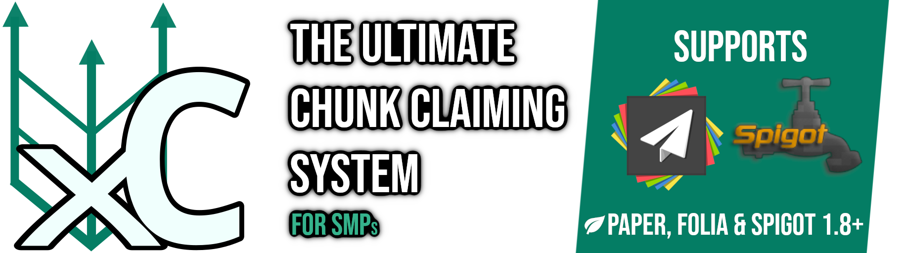

<!-- This file was automatically generated by Nanolaba Readme Generator (NRG) 1.1 -->
<!-- Visit https://github.com/nanolaba/readme-generator for details -->
<h1 align="center">

</h1>

<h2>
<a href="https://github.com/WasabiThumb/xclaim/blob/master/README.md" title="American English">🇬🇧</a>
&nbsp;
<a href="https://github.com/WasabiThumb/xclaim/blob/master/README.de.md" title="German">🇩🇪</a>
&nbsp;
<a href="https://github.com/WasabiThumb/xclaim/blob/master/README.zh.md" title="Chinese (Simplified)">🇨🇳</a>
&nbsp;
<a href="https://github.com/WasabiThumb/xclaim/blob/master/README.tr.md" title="Turkish">🇹🇷</a>
</h2>

  <a style="margin:0.3rem;padding:0.5em;background-color:#303030;border-radius:0.5em" href="#kurulum">Kurulum</a>
  <a style="margin:0.3rem;padding:0.5em;background-color:#303030;border-radius:0.5em" href="#özellikler">Özellikler</a>
  <a style="margin:0.3rem;padding:0.5em;background-color:#303030;border-radius:0.5em" href="#config">Config</a>
  <a style="margin:0.3rem;padding:0.5em;background-color:#303030;border-radius:0.5em" href="#yetkiler">Yetkiler</a>
  <a style="margin:0.3rem;padding:0.5em;background-color:#303030;border-radius:0.5em" href="#komutlar">Komutlar</a>
  <a style="margin:0.3rem;padding:0.5em;background-color:#303030;border-radius:0.5em" href="#desteklenen-sürümler">Desteklenen Sürümler</a>
  <a style="margin:0.3rem;padding:0.5em;background-color:#303030;border-radius:0.5em" href="#planlar">Planlar</a>

## Kurulum
[Sağdaki sürümler sekmesinden](https://github.com/WasabiThumb/xclaim/releases) hazır halini indirebilirsiniz ya da isterseniz [plugini kendiniz de oluşturabilirsiniz](https://maven.apache.org/guides/getting-started/maven-in-five-minutes.html#build-the-project). Ardından JAR dosyasını plugin klasörüne atın. Ne yaptığınızı bilmiyorsanız "orijinal" etiketli JAR'ı kullanmayın. 

## Özellikler
Ana komut /xclaim'dir (takma ad /xc). Bu, oyuncuların alanlarını oluşturmasına ve yönetmesine olanak tanır. Alanların, genel gruplar (hiç kimse, güvenilir oyuncular, kıdemli oyuncular ve tüm oyuncular) veya bireyler tarafından değiştirilebilen çeşitli izinleri vardır. GUI ayrıca oyuncuların güvenilir listelerine oyuncu eklemesine/çıkarmasına da olanak tanır

### Harita Entegrasyonu
- Harita entegrasyonu, [düzgün şekilde yapılandırıldığı](#config) sürece kutudan çıktığı gibi çalışmalıdır. Aksi takdirde lütfen [Sorunlar sayfasında](https://github.com/WasabiThumb/xclaim/issues) bir sorun oluşturun.
- BlueMap entegrasyonu da 1.10.0 sürümünden beri desteklenmektedir.

### ClaimChunk'tan bilgi aktarma
Bu işlem çevrimiçi herhangi bir oyuncu olmadan yapılmalıdır. Sunucuda ClaimChunk VE XClaim'in aynı anda yüklü olması gerekir. Bunu yaparken sunucuda PlaceholderAPI'ye de ihtiyacınız olması mümkündür, ancak XClaim'in normal çalışması için kesinlikle ne ClaimChunk'a ne de PlaceholderAPI'ye ihtiyacınız yoktur. Tüm bu koşullar yerine getirildikten sonra /importclaims komutunu çalıştırın. Bu işlem bitişik olan alanlardaki chunkları bir grup haline getirmeye çalışacağından biraz zaman alabilir veya yoğun kaynak gerektirebilir.

### Diller
1.6.x sürümünden itibaren birden fazla dil desteklenmektedir. Eklenti başlatıldığında, varsayılan dil paketleri ``/plugins/XClaim/lang`` dosyasına yüklenir. Aşağıda varsayılan dil paketlerinin bir listesi bulunmaktadır:
- en-US (Amerikan İngilizcesi)
- de (Almanca) eingruenesbeb tarafından
- zh (Basitleştirilmiş Çince) SnowCutieOwO tarafından
- tr (Türkçe) Krayir5 tarafından

Eklenti, [config](#config) dosyasındaki "dil" seçeneğine göre hangi dilin kullanılacağına karar verir.
\
\
Kendi dil paketinizi oluşturmak istiyorsanız örnek olarak mevcut bir paketi kopyalayın (ör. ``/plugins/XClaim/lang/tr.json``) ve onu [buna göre](https://en.wikipedia.org/wiki/List_of_ISO_639-1_codes) yeniden adlandırın (örn. ``fr.json``). Daha sonra bu dosyanın içeriğini çevirebilirsiniz. [JSON](https://en.wikipedia.org/wiki/JSON#Syntax) ve [MiniMessage](https://docs.adventure.kyori.net/minimessage/index.html) bilgisi önemle tavsiye edilir. Anahtarları çevirmeyin, yalnızca değerleri çevirin. Dil paketleri, kodlamanın ardından insanlar tarafından daha az okunabilir hale gelebilir; bu nedenle, dil paketi tabanınızı [kaynaktan](https://github.com/WasabiThumb/xclaim/tree/master/src/main/resources/lang) almanız önerilir. ``$1``, ``$2`` gibi simgelerin kullanıldığı bazı durumlar vardır. Bu, "buraya bir şey eklenmiş" anlamına gelir; örneğin "Merhaba $1!", oyun içinde "Merhaba Kullanıcı Adı!" olarak çözülebilir.

### Ekonomi
Varsayılan olarak ekonomi özellikleri devre dışıdır. Bunları etkinleştirmek için yapılandırmadaki "use-economy" seçeneğini true olarak ayarlayın.\
Ekonomi kullanımı etkinleştirilirse XClaim, eğer varsa aşağıdaki ekonomi eklentilerine bağlanmayı deneyecektir:
- Vault
- EssentialsX

Oyuncular daha sonra oyuncunun bulunduğu izin grubuna bağlı olarak ödeme yapacaklardır (bkz. [buraya](#permissions)).\
Örneğin, bir talebin varsayılan fiyatını 2,25 olarak ayarlamak isterseniz ``limits.default.claim-price`` değerini ``2,25`` olarak ayarlarsınız.\
[config kısmında](#config) tüm seçeneklere bakabilirsiniz.

## Config
| İsim | Açıklaması | Varsayılan Değer |
| --: | :-: | :-- |
| language | Pluginin kullanılacağı dil, ``/plugins/XClaim/lang`` adresinden geçerli bir dil paketi olmalıdır, aksi takdirde en-US'ye geri döner | en-US |
| veteran-time | "Veteran" statüsünün geçerli olması için bir oyuncunun sunucuda olması için gereken saniye cinsinden süre | 604800 (1 week) |
| stop-editing-on-shutdown | Oyuncuların sunucu kapatıldığında chunk düzenleyicisinden çıkarılıp çıkarılmaması gerektiği | false |
| stop-editing-on-leave | Oyuncuların gönüllü olarak ayrıldıklarında chunk düzenleyiciden çıkarılıp çıkarılmaması gerektiği | true |
| exempt-claim-owner-from-permission-rules | Alan sahiplerinin alan üzerindeki tüm izinlere örtülü olarak erişmesi gerekiyorsa. Bunu değiştirmemelisiniz, esas olarak hata ayıklama amaçlıdır | true |
| enforce-adjacent-claim-chunks | Bir hak talebindeki chunkların yan yana olup olması gerekip gerekmediği | true |
| allow-diagonal-claim-chunks | Fenforce-adjacent-claim-chunks true olarak ayarlıysa bu, birbirinden köşegen olan chunkların birbirinin "yanında" olarak kabul edilip edilmeyeceğini belirler. Aksi takdirde hiçbir şey yapmaz. | true |
| claim-min-distance | 0'dan büyükse, farklı oyuncular tarafından talep edilen parçalar arasındaki minimum mesafeyi belirler | 0 |
| enter-chunk-editor-on-create | Eğer true değerindeyse, oyuncular yeni bir alan oluşturduklarında chunk düzenleyicisine girecekler | true |
| use-economy | Ekonomi özelliklerinin kullanılıp kullanılmayacağı | false |
| limits.𝘨𝘳𝘰𝘶𝘱-𝘯𝘢𝘮𝘦.max-chunks | Bir grup için maksimum parçaları ayarlar. Daha fazla bilgi için İzinler konusuna bakın. | |
| limits.𝘨𝘳𝘰𝘶𝘱-𝘯𝘢𝘮𝘦.max-claims | Bir grup için maksimum alanları ayarlar. Daha fazla bilgi için İzinler konusuna bakın. | |
| limits.𝘨𝘳𝘰𝘶𝘱-𝘯𝘢𝘮𝘦.give-after | Bir oyuncunun otomatik olarak bu gruba girinceye kadar oynaması için gereken saniye cinsinden süre. 0'dan küçük değerler "hiçbir zaman" anlamına gelir. | -1 |
| limits.𝘨𝘳𝘰𝘶𝘱-𝘯𝘢𝘮𝘦.claim-price | Ekonomi etkinleştirilmişse, alana bir chunk eklemenin fiyatını belirler. | 20 |
| limits.𝘨𝘳𝘰𝘶𝘱-𝘯𝘢𝘮𝘦.unclaim-reward | Ekonomi etkinleştirilmişse, bir chunkın iade edilmesi durumunda geri ödeme tutarını ayarlar. | 0 |
| limits.𝘨𝘳𝘰𝘶𝘱-𝘯𝘢𝘮𝘦.free-chunks | Ekonomi etkinleştirilmişse, bir sonraki alan için ``limits.𝘨𝘳𝘰𝘶𝘱-𝘯𝘢𝘮𝘦.claim-price`` ödemesi gerekmeden önce bir oyuncunun ücretsiz olarak alabileceği chunk miktarını ayarlar.. | 4 |
| limits.𝘨𝘳𝘰𝘶𝘱-𝘯𝘢𝘮𝘦.max-claims-in-world | Her dünyada aynı anda izin verilen maksimum alan sayısı. 1'den küçük değerler limitin olmadığını gösterir. | -1 |
| dynmap-integration.enabled | True değerindeyse, XClaim başlangıçta Dynmap pluginini arayacak ve ona bağlanacaktır. Kapatıldığında hafif derecede hızlanma gözlemlenebilir. | true |
| dynmap-integration.use-old-outline-style | Eğer doğruysa, Dynmap alandaki eski dışbükey gövde hatlarını kullanacaktır. Yeni taslak sistemi deneysel olduğundan bu esas olarak hata ayıklama amaçlıdır. | false |
| disable-paper-warning | Sunucu Paper yerine Spigot'u çalıştırırken başlangıçta konsola gönderilen mesajı devre dışı bırakır | false |
| worlds.use-whitelist | Eğer worlds.whitelist dikkate alınmalıysa | false |
| worlds.use-blacklist | Eğer worlds.blacklist dikkate alınmalıysa | false |
| worlds.case-sensitive | Beyaz/kara listedeki dünya adlarında büyük harf kullanımının önemli olup olmadığı | true |
| worlds.whitelist | Bir dünyanın XClaim ile çalışması için bulunması gereken bir liste | a sample list |
| worlds.blacklist | Bir dünyanın XClaim ile çalışması için içinde OLMAMASI gereken bir liste | a sample list |
| worlds.grace-time | Bir alan izin verilmeyen bir dünyadaysa, alan otomatik olarak kaldırılmadan önce oyuncuların saniyeler içinde belirtilen zaman kadar zamanları olur | 604800 (1 week) |

## Yetkiler
Merak etmeyin, o kadar da çok yok.
| İsim | Açıklama |
| --: | :-- |
| xclaim.override | Sahip olunan chunkların üzerine yazmanıza olanak tanır |
| xclaim.admin | Herhangi bir alanı değiştirmenizi/silmenizi sağlar |
| xclaim.import | ClaimChunk eklentisinden alanları içe aktarmanıza olanak tanır |
| xclaim.update | Otomatik güncelleyiciyi kullanmanızı sağlar |
| xclaim.restart | XClaim'i yeniden başlatabilmenizi sağlar |
| xclaim.clear | /xclaim clear komutuyla oyuncuların alanlarının temizlenmesine izin verir |
| xclaim.group.𝘨𝘳𝘰𝘶𝘱-𝘯𝘢𝘮𝘦 | Bir oyuncu bu izne sahipse bu grubun bir parçasıdır. Oyuncular, bulundukları her gruptan "en iyi" değerleri devralır. Eğer grup "varsayılan" olarak adlandırılırsa, tüm oyuncular dolaylı olarak bu grupta yer alır. |

## Komutlar
| İsim | Açıklama |
| --: | :-- |
| xclaim | XClaim ana komutu. Herhangi bir ekstra argüman olmadan, /xclaim gui ile aynıdır |
| xclaim help | Kullanılabilir alt komutları listeleyin |
| xclaim info | XClaim hakkında genel bilgileri sağlar |
| xclaim gui | XClaim'in önemli özelliklerinin çoğunu kapsayan, kullanımı kolay bir GUI açar |
| xclaim update | XClaim'in yeni sürümlerini tarar ve istenirse otomatik güncellemeyi çalıştırır |
| xclaim chunks \[alan_ismi] | Belirtilen alan için chunk düzenleyicisini veya belirtilmediyse mevcut alan'ı açar |
| xclaim current | Bulunduğunuz alan hakkında bilgi alır |
| xclaim restart | Sunucuyu yeniden başlatmadan XClaim'i yeniden başlatın (deneysel) |
| xclaim clear | Belirtilen oyuncunun tüm alanlarını siler |
| xclaim list | Bir oyuncunun sahip olduğu tüm alanları listeler |
| importclaims | ClaimChunk'tan alanları içe aktar |

## Placeholders
PlaceholderAPI entegrasyonu pluginin 1.13 sürümünde eklendi
| İsim | Açıklama |
| --: | :-- |
| xclaim_claim_count | Bir oyuncunun sahip olduğu alan sayısı |
| xclaim_claim_count_in_*world* | Bir oyuncunun *world* dünyasında sahip olduğu alan sayısı |
| xclaim_claim_max | Bir oyuncunun sahip olabileceği maksimum alan sayısı |
| xclaim_chunk_count | Bir oyuncunun sahip olduğu toplam chunk sayısı |
| xclaim_chunk_count_in_*world* | Bir oyuncunun *world* dünyasında sahip olduğu chunkların toplam sayısı |
| xclaim_chunk_max | Bir oyuncunun **bir alanda** alabileceği maksimum chunk sayısı |
| xclaim_chunk_max_abs | Oyuncunun mümkün olduğu kadar çok alanı varsa ve her alanda mümkün olduğu kadar çok chunk varsa, bir oyuncunun sahip olabileceği maksimum chunk sayısı |

## Desteklenen Sürümler
|         | 1.8 - 1.11 | 1.12 - 1.13 | 1.14 - 1.16 | 1.17 - 1.19 | 1.20 | Folia | Paper & Spigot |
| --:     | :-:  | :-:  | :-:  | :-:  | :-:  | :-:  | :-:  |
| 1.5.0   | ❌   | ❌   | ❌   | ✔    | ❌    | ❌   | ✔     | 
| 1.8.0   | ❌   | ❌   | ✔    | ✔    | ❌    | ❌    | ✔     | 
| 1.9.0   | ❌   | ✔   | ✔    | ✔    |❌    | ❌    | ✔     |
| 1.9.1  | ✔   | ✔   | ✔    | ✔    | ❌    | ❌    | ✔     | 
| 1.10.0  | ✔   | ✔   | ✔    | ✔    | ✔    | ❌    | ✔     | 
| 1.10.2  | ✔   | ✔   | ✔    | ✔    | ✔    | ✔    | ✔     |
| 1.12.0  | ✔   | ✔   | ✔    | ✔    | ✔    | ✔    | ✔     | 

Sürüm 1.5.0'dan öncesi artık desteklenmemekte

## Planlar
* Daha fazla yönetim komutu eklemek

